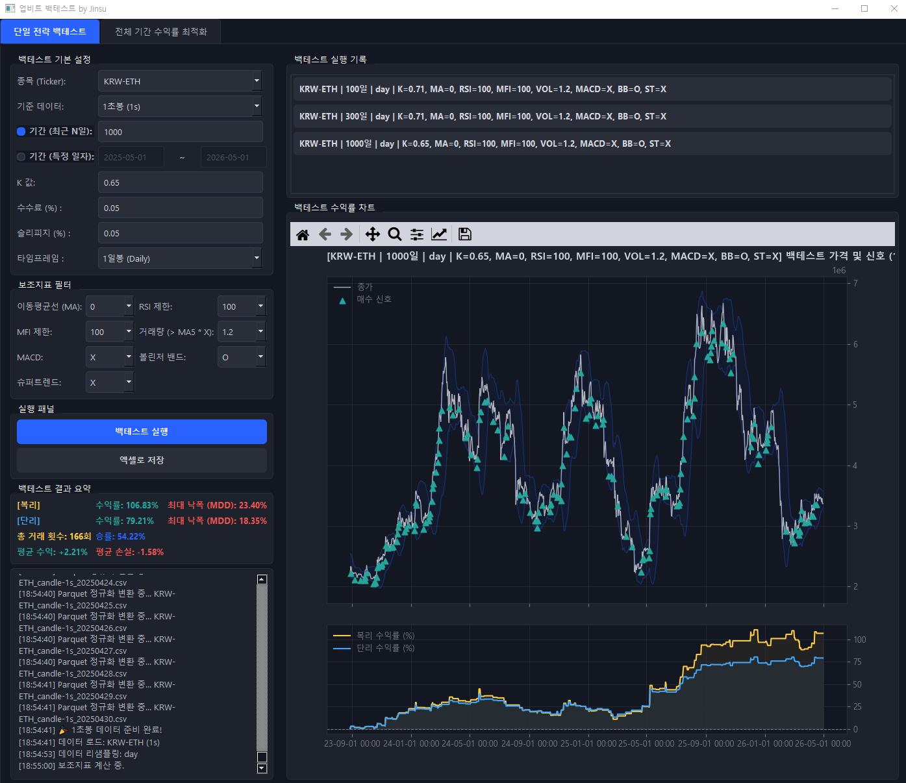
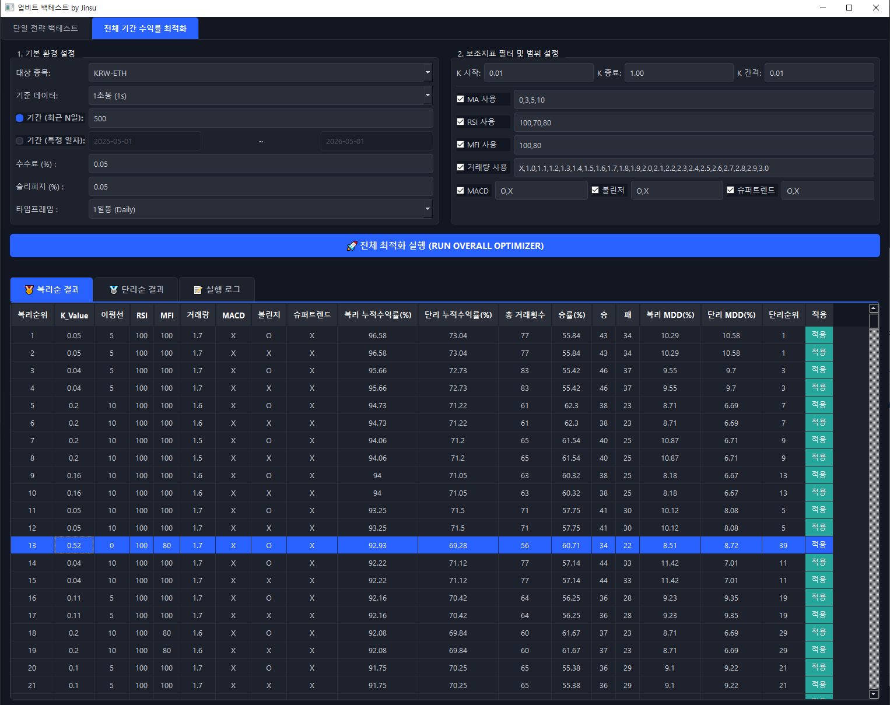

# 가상화폐 지표를 조합한 변동성 돌파 전략 백테스트 프로그램 (업비트)

비트코인, 이더리움, 리플을 대상으로 변동성 돌파 전략을 지표와 조합하여 백테스팅하는 프로그램입니다.

<p align="center">
  
  
</p>

## 🛠️ 주요 기능

* **정밀 데이터 분석**: 1분봉 및 1초봉 선택 가능. 분석에 적합한 **Parquet 형식**으로 변환하여 백테스트합니다.
    * *(1초봉은 업비트 API 센터에서 2023년 9월 1일부터 제공)*
* **마켓 데이터 주소**: [업비트 마켓데이터 바로가기](https://www.upbit.com/historical_data/download?prefix=candle)
* **다양한 보조지표**: 이동평균선, RSI, MFI, MACD, 볼린저 밴드, 슈퍼트렌드(SuperTrend) 등 활용.
* **예상 거래량**: 1초 단위 데이터를 기반으로 봉 마감 전 예상 거래량 계산 및 매수 시점 감지.
* **초고속 최적화**: CPU 멀티 코어 활용, 수만 가지 파라미터 조합 동시 시뮬레이션.
* **정밀 시뮬레이션**: 수수료 및 슬리피지 반영, 복리/단리 수익률 및 MDD 산출.

---

## 📂 파일 구조 (File Structure)

| 파일명 | 역할 및 설명 |
| :--- | :--- |
| **`main.py`** | 프로그램 실행을 담당하는 메인 파일 |
| **`data_updater.py`** | 업비트 마켓 데이터 호출 및 최신화 |
| **`strategy.py`** | 변동성 돌파 및 지표 조합 매매 로직 핵심 코드 |
| **`app.py`** | 사용자 인터페이스(UI) 및 화면 구성 |
| **`threads.py`** | 원활한 동작을 위한 비동기 처리 및 스레드 관리 |

---

## 🚀 실행 방법 (CMD)

아래 순서대로 명령어를 실행해 주세요.
```bash
git clone https://github.com/yoojinsu/Upbit-Backtest.git
cd Upbit-Backtest
pip install -r requirements.txt
python main.py```

마켓 데이터 주소: 업비트 마켓데이터 바


